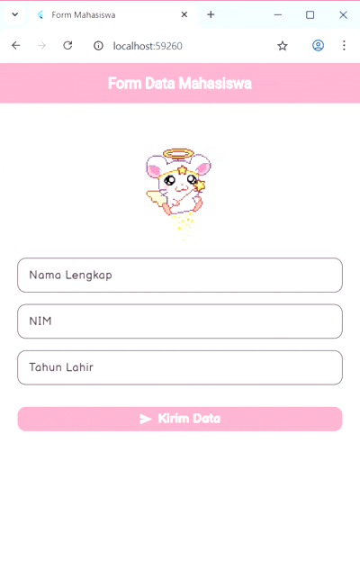

# TUGAS 6 - Essay Bina Mukti

## Deskripsi
Proyek Flutter ini menampilkan proses **passing data antar halaman** menggunakan **Navigator** dan **constructor**.  
Pengguna akan mengisi form berisi:
- Nama  
- NIM  
- Tahun Lahir  

Kemudian data akan dikirim dan ditampilkan pada halaman hasil.

---

## Proses Passing Data

### 1️. Input Data di `form_data.dart`
Data diambil dari `TextEditingController` (nama, nim, tahun).  
Setelah tombol **"Kirim Data"** ditekan dan form valid, aplikasi akan melakukan navigasi ke halaman `TampilDataPage`.

---

### 2️. Mengirim Data
```dart
Navigator.push(
  context,
  MaterialPageRoute(
    builder: (context) => TampilDataPage(
      nama: namaController.text,
      nim: nimController.text,
      tahun: tahunController.text,
    ),
  ),
);
```
➡️ Data dikirim lewat parameter konstruktor pada `TampilDataPage`.

---

### 3️. Menerima dan Menampilkan Data
```dart
class TampilDataPage extends StatelessWidget {
  final String nama;
  final String nim;
  final String tahun;

  const TampilDataPage({
    required this.nama,
    required this.nim,
    required this.tahun,
  });

  @override
  Widget build(BuildContext context) {
    return Scaffold(
      body: Center(
        child: Text('Nama: $nama\nNIM: $nim\nTahun Lahir: $tahun'),
      ),
    );
  }
}
```
➡️ Data yang dikirim dari halaman form akan diterima sebagai variabel melalui konstruktor, kemudian ditampilkan dalam widget `Text` di halaman hasil.

## GIF
